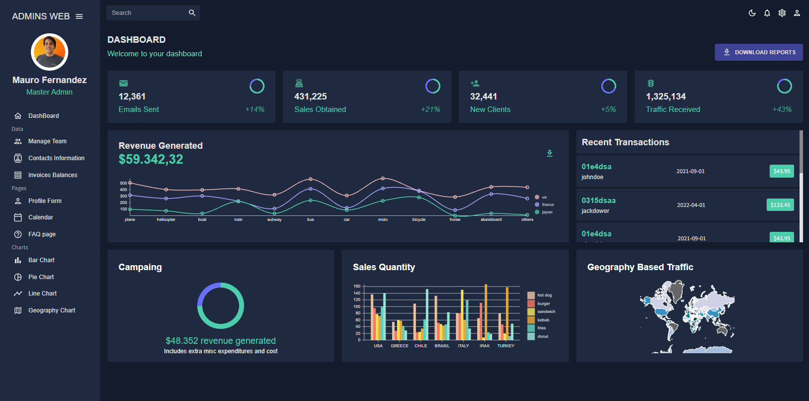
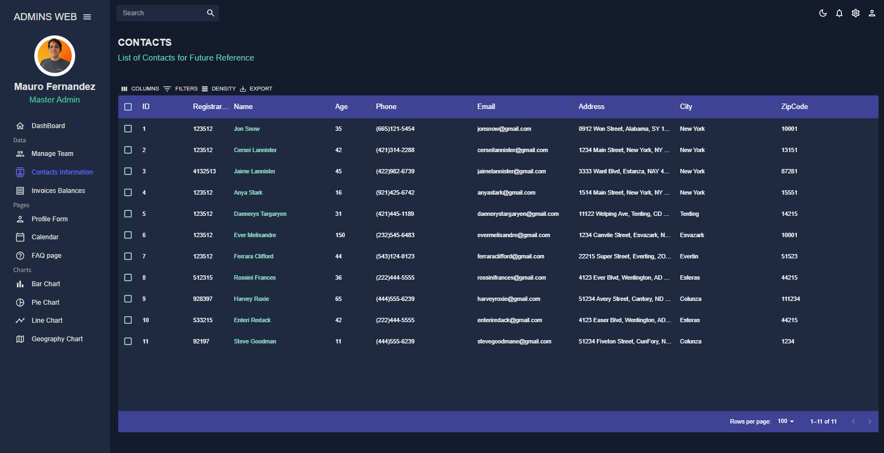
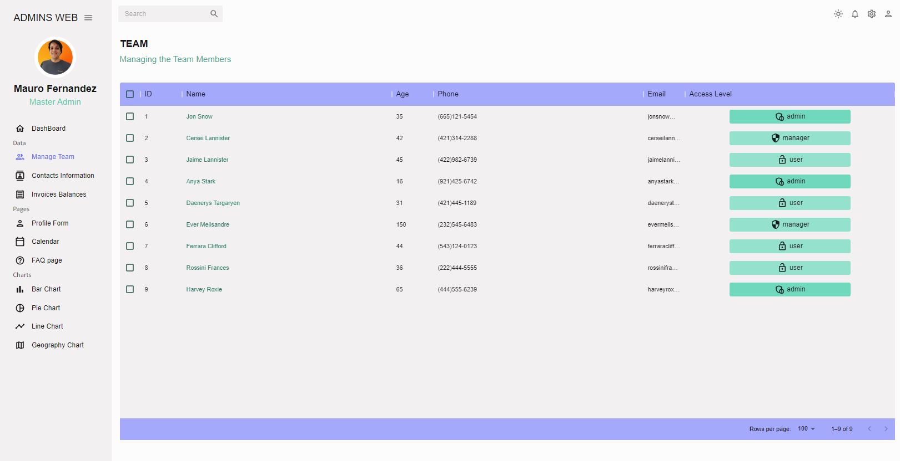
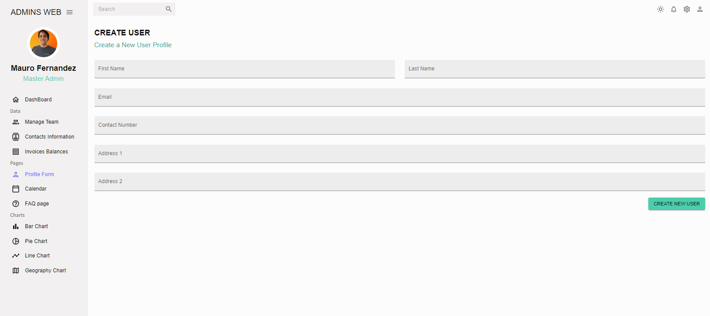
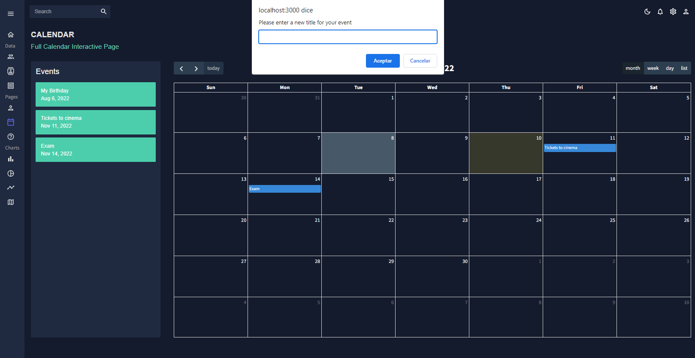
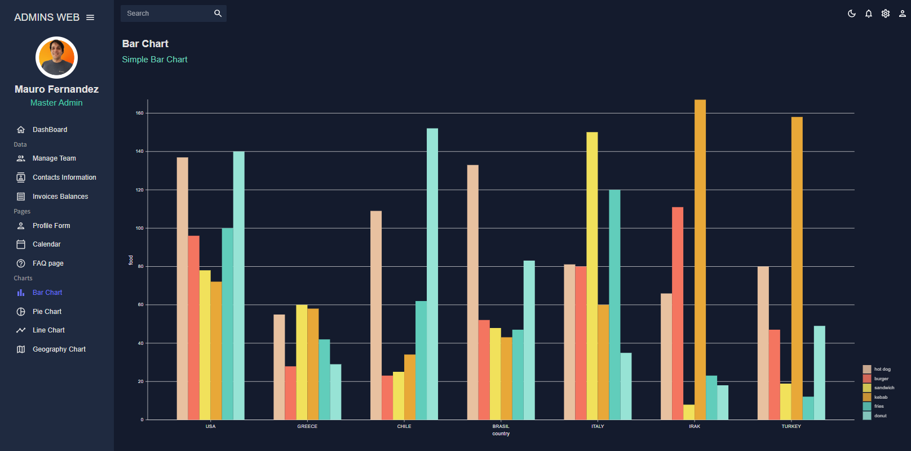

# React Admin Dashboard

The goal of this project is to learn how to work with [Material UI](https://mui.com/material-ui/getting-started/overview/), [formik](https://formik.org/docs/overview#installation), [yup](https://www.npmjs.com/package/yup), [fullcalendar](https://fullcalendar.io/docs) & [nivo](https://nivo.rocks/components/).\
Also practice certain implementations like dark and light mode, & the use of data grid.

##  Is this an original project?

No, I saw a video from EdRoh on how to build a complete react admin dashboard. 
[Link to the video](https://www.youtube.com/watch?v=wYpCWwD1oz0)

## Some Pics from the project

  
  
  
  
  
  

## Available Scripts

In the project directory, you can run:

### `npm start`

Runs the app in the development mode.\
Open [http://localhost:3000](http://localhost:3000) to view it in your browser.

The page will reload when you make changes.\
You may also see any lint errors in the console.

### `npm run build`

Builds the app for production to the `build` folder.\
It correctly bundles React in production mode and optimizes the build for the best performance.

The build is minified and the filenames include the hashes.\
Your app is ready to be deployed!